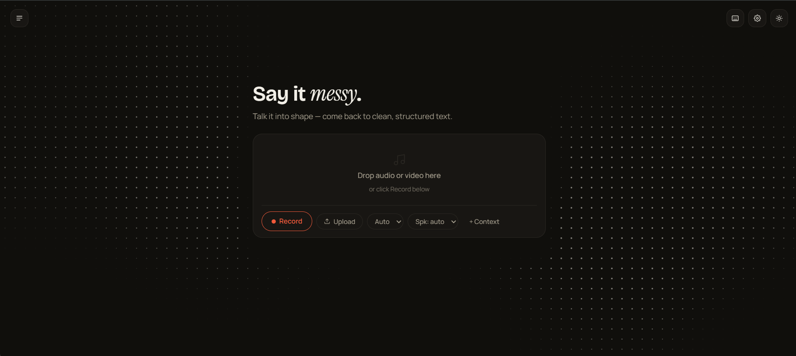
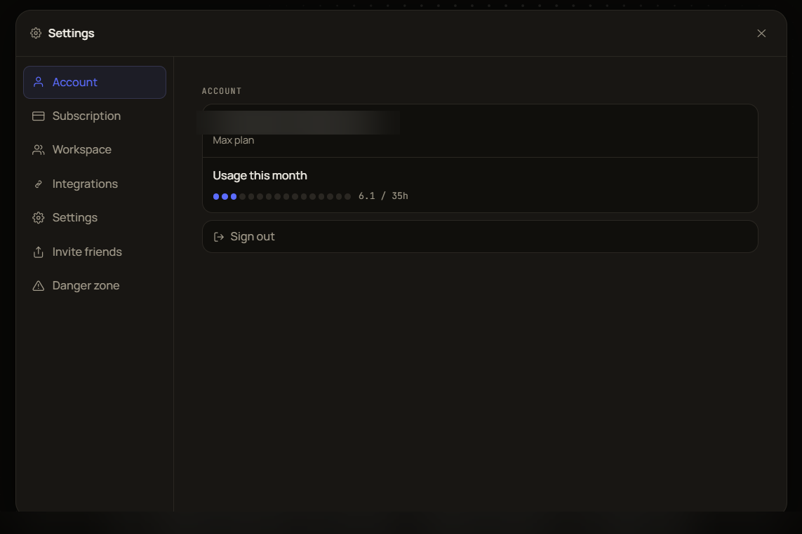
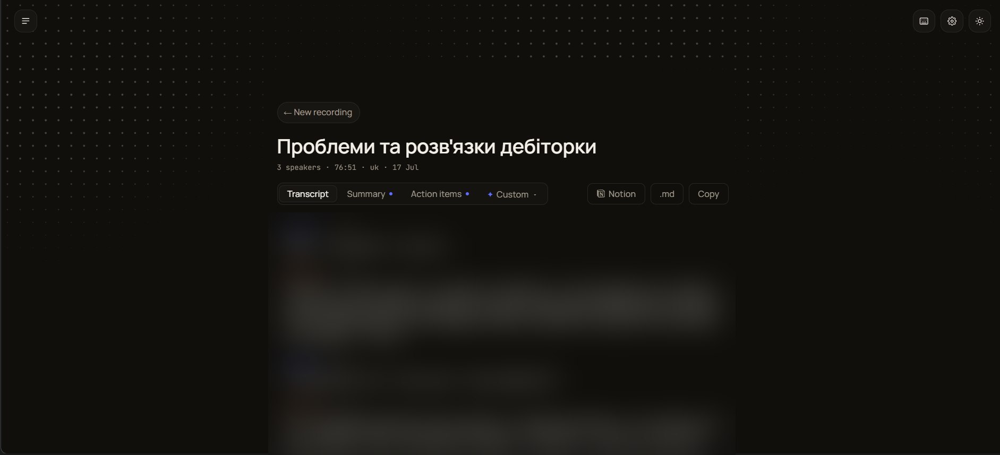
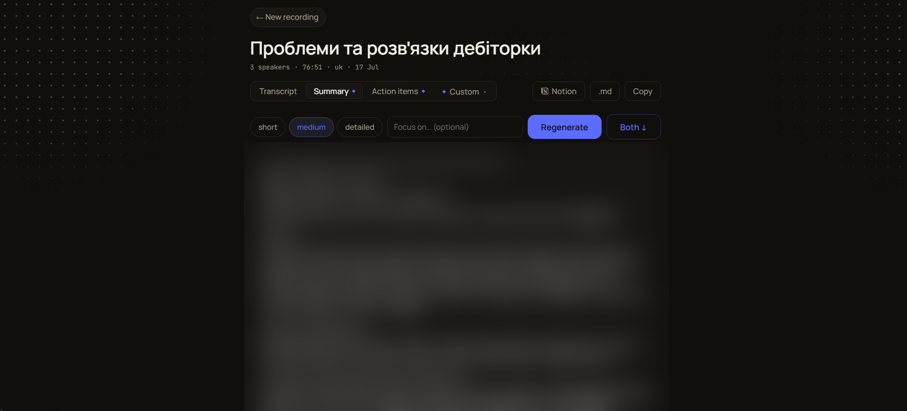

# Skriptly

[](https://github.com/razornne/skriptly/actions/workflows/ci.yml)
[](https://www.python.org/downloads/)
[](LICENSE)

Cloud call-transcription platform with speaker diarization and LLM-powered
post-processing. Record or upload a call, get a speaker-labeled transcript,
an AI summary, and action items — in Ukrainian, Russian, English, or Polish.

**Live product:** [skriptly.io](https://skriptly.io)

This repo is a portfolio snapshot of the production codebase, with internal
planning docs and infra-specific configuration stripped out. Live URLs and
keys in comments below are illustrative, not the real deployment.

---

<p align="center">
  
  
</p>
<p align="center">
  
  
</p>

<sub>Transcript and summary content is blurred — it's from a real user call.</sub>

---

## What it does

- **Record in-browser** — mixes microphone + shared tab/system audio into a
  single stream, chunked to IndexedDB every 5s so nothing is lost if the tab
  crashes or the network drops mid-call.
- **Upload any file** — audio or video, any ffmpeg-readable format. Large
  video files get their audio track extracted and recompressed client-side
  (ffmpeg.wasm) before upload, to stay under storage limits.
- **Transcribe + diarize** — faster-whisper (large-v3-turbo, or large-v3 for
  higher-tier plans) + pyannote speaker diarization, merged with a custom
  word-level alignment algorithm (see [`merger.py`](./merger.py)).
- **Long recordings (3-4h calls)** — audio is split into silence-aware
  chunks, transcribed in parallel across multiple GPUs, and re-stitched with
  a custom speaker-embedding clustering step that keeps identities consistent
  across chunk boundaries (see [`modal_app.py`](./modal_app.py), functions
  `transcribe_long` / `_cluster_speaker_embeddings`).
- **LLM correction pass** — an LLM fixes phonetic STT errors using world
  knowledge (e.g. a mangled acronym or name), and can move misattributed
  words across a speaker boundary when grammar makes the error obvious.
- **Self-learning vocabulary** — terms the correction pass fixes are
  extracted into a per-user `wrong → right` memory, which then both primes
  the transcription prompt and hints the next correction pass — so accuracy
  on your specific jargon improves over time without any manual input.
- **AI summary / action items** — generated by a long-context model over the
  full transcript, with adjustable detail level and a free-text focus field.
- **Auth + sync** — Google OAuth / email magic link via Supabase, transcript
  history synced across devices via Postgres with row-level security.
- **Workspaces** — shared team history, per-seat billing.

---

## Architecture

<picture>
  <source media="(prefers-color-scheme: dark)" srcset="docs/architecture-dark.svg">
  
</picture>

<sub>Both themes are generated from one definition by
<code>docs/make_diagram.py</code> — two hand-drawn files drift.</sub>

The backend is stateless — it only processes audio and validates tokens.
All persistent state lives in Postgres. GPU workers scale to zero when idle;
a single expensive resource (GPU) is only paid for while actually
transcribing, including during the parallel fan-out for long recordings.

---

## Interesting engineering problems this project solves

**Stitching speakers across parallel GPU workers.** A 3-4 hour call gets
split into ~10 independent chunks processed on separate GPUs simultaneously.
Each worker only knows its own local speakers ("local speaker 1", "local
speaker 2" — with no idea these are the same people as the previous chunk's
speakers). The orchestrator re-identifies who's who globally using voice
embeddings and a custom agglomerative clustering step with a **cannot-link
constraint**: two local speakers detected within the *same* chunk are
structurally guaranteed to be different people (the diarization model
already told us that), so they're never merged into the same global
identity — even if their voices sound similar. A secondary "phantom escape"
threshold catches the opposite failure mode: when the diarization model
over-segments a single voice into two local speakers, those get merged
before the cannot-link constraint would otherwise keep a phantom speaker
alive across the whole call. See `_cluster_speaker_embeddings` in
[`modal_app.py`](./modal_app.py).

**Merging word-level ASR output with diarization output.** Two independent
models disagree about *where* speaker turns happen and about sentence
boundaries. Short segments (≤2s) get resolved by majority vote of the
underlying word-level speaker labels; longer segments get split at the exact
word where the speaker changes. Iterative smoothing then collapses
spurious back-and-forth flips between the same two speakers. See
[`merger.py`](./merger.py).

**Long-context correction without exceeding memory.** For the
privacy-preserving/local-model correction path, a naive single-pass prompt
over a multi-hour transcript can exceed available GPU memory for models that
only support eager (O(n²)) attention. That path uses a map-reduce split:
the transcript is windowed, each window is compressed into dense notes, and
the notes are recombined in a final pass — while the default cloud-LLM path
handles the whole transcript in one call given a large enough context
window.

**Resilience by design.** Each parallel chunk in the long-recording pipeline
is wrapped so a single chunk failure (after retries) doesn't fail the whole
job — it's logged, skipped, and replaced with a localized gap marker in the
transcript, and the job still completes with the rest of the audio intact.

---

## Where this is going

The product works and has paying users; what follows is shaped by what those
users actually hit, not by what is interesting to build.

**From batch to streaming.** Today the whole thing is batch: record or upload,
wait, read. That is the right shape for a 3-hour workshop and the wrong one for
a 20-minute standup you want to act on immediately. Streaming is not a feature
bolted onto this pipeline — it inverts it. Diarization currently gets the whole
file and can reason globally about who spoke; a streaming version has to commit
to a speaker label before it has heard the rest of the call, and revise. The
interesting question is not latency, it is what you do when a revision
contradicts something the user has already read.

**The correction loop should train the model, not just the prompt.** Every
correction a user accepts is already stored as a wrong→right pair and fed back
into the next transcription's prompt. That is a cheap, immediate win and a
ceiling: prompting can only bias the decoder. The same pairs are training data
for a fine-tune on the languages where off-the-shelf Whisper is weakest —
Ukrainian and Russian in this user base. The flywheel exists; it currently
turns one notch and stops.

**Search across the archive, not within one transcript.** Users accumulate
hundreds of calls and then cannot find the one where a decision was made.
Transcripts already sit in Postgres, so this is embeddings and pgvector over
data that is already there — the work is in making "which call was that in?"
answerable without reading ten of them.

**Cost and quality as a tracked number.** There is a WER and deletion-rate
evaluation set, which is what stopped tuning decisions from being guesses. It
does not yet track cost per minute alongside quality, and those two move
together every time a model is swapped. Without both on the same chart, "we
improved quality" and "we doubled the bill" are indistinguishable.

**The unglamorous one.** Billing moves to a Merchant-of-Record provider. It
changes nothing technically interesting and it is the difference between taking
money legally in thirty countries and not.

Things deliberately not being built: a mobile app (the browser handles the
recording cases that matter), and real-time translation (a different product
wearing this one's clothes).

---

## Stack

| Layer | Tech |
|---|---|
| Transcription | faster-whisper (large-v3 / large-v3-turbo) |
| Diarization | pyannote speaker diarization |
| Speaker embeddings | wespeaker |
| STT correction / summarization | LLM API (cloud) with a local-model fallback path |
| Compute | Modal (serverless GPU, scale-to-zero) |
| Backend API | Flask (WSGI on a serverless CPU container) |
| Auth + DB | Supabase (Postgres with RLS, Google OAuth + magic link) |
| Frontend | Next.js 15 (App Router), TypeScript |
| Billing | Stripe (per-seat team subscriptions) |
| Analytics | PostHog (self-hosted proxy to dodge ad-blockers) |

---

## Repo layout

```
app.py                — Flask backend: endpoints, JWT validation, async job
                         orchestration, billing, usage tracking
modal_app.py           — GPU/CPU worker definitions: transcription pipeline,
                         long-recording orchestrator, speaker clustering
merger.py              — word-level ASR/diarization alignment (shared)
transcriber.py         — local-mode faster-whisper wrapper
diarizer.py            — local-mode diarization wrapper
migrations/            — Postgres schema migrations (hand-applied, numbered)
tests/                 — pure-logic unit tests (merger, chunk planning,
                         speaker clustering, map-reduce splitting)
landing/               — Next.js app: marketing site + the transcription
                         studio itself (components/ink/, lib/ink/)
```

---

## Running locally

Requires an NVIDIA GPU (6+ GB VRAM) for the local transcription path, or set
`USE_MODAL=true` to offload transcription to a deployed Modal backend while
running everything else locally.

```bash
python -m venv venv
source venv/bin/activate  # or venv\Scripts\activate on Windows
pip install torch torchaudio --index-url https://download.pytorch.org/whl/cu124
pip install -r requirements.txt

cp .env.example .env   # fill in HF_TOKEN at minimum
python app.py          # → http://localhost:5000
```

```bash
cd landing
npm install
cp .env.example .env.local   # fill in Supabase + API base
npm run dev             # → http://localhost:3000
```

Tests are plain-Python, no framework:

```bash
python tests/test_merger.py
python tests/test_speaker_clustering.py
# etc — each file is a self-contained runner
```

---

## License

MIT
